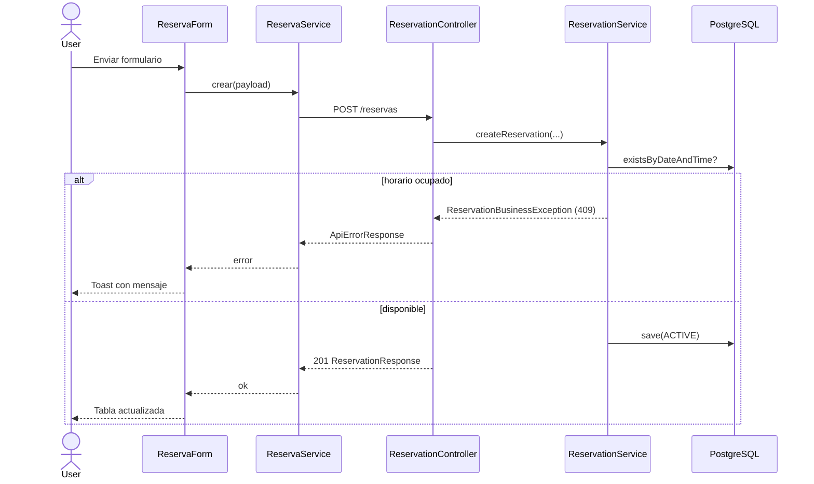

# Reservatdea

Sistema full-stack de gestión de reservas. Permite crear, listar y cancelar reservas de servicios a través de una API REST en Spring Boot y una interfaz web en React.

**Repositorio:** [github.com/diegobotia/reservatdea](https://github.com/diegobotia/reservatdea)

---

## Tabla de contenidos

- [Características](#características)
- [Stack tecnológico](#stack-tecnológico)
- [Arquitectura](#arquitectura)
- [Estructura del proyecto](#estructura-del-proyecto)
- [Requisitos previos](#requisitos-previos)
- [Configuración y puesta en marcha](#configuración-y-puesta-en-marcha)
- [API REST](#api-rest)
- [Frontend](#frontend)
- [Variables de entorno](#variables-de-entorno)
- [Reglas de negocio](#reglas-de-negocio)
- [Manejo de errores](#manejo-de-errores)
- [Documentación OpenAPI](#documentación-openapi)
- [Scripts útiles](#scripts-útiles)
- [Convenciones de desarrollo](#convenciones-de-desarrollo)

---

## Características

- Crear reservas con cliente, fecha, hora y servicio
- Listar todas las reservas en una tabla
- Cancelar reservas activas
- Validación de datos en backend (Jakarta Validation)
- Prevención de solapamientos (misma fecha y hora)
- Mensajes de error visibles en toast en el frontend
- CORS habilitado entre `localhost:3000` (UI) y `localhost:8080` (API)
- Documentación interactiva con springdoc-openapi (Swagger UI)

---

## Stack tecnológico

### Backend

| Tecnología | Versión / detalle | Uso |
|------------|-------------------|-----|
| **Java** | 21 | Lenguaje principal |
| **Spring Boot** | 4.0.7 | Framework de aplicación |
| **Spring Web MVC** | vía `spring-boot-starter-webmvc` | API REST |
| **Spring Data JPA** | vía starter | Persistencia |
| **Hibernate** | (incluido en Spring Data JPA) | ORM |
| **PostgreSQL** | driver oficial | Base de datos |
| **Jakarta Validation** | vía `spring-boot-starter-validation` | Validación de DTOs |
| **springdoc-openapi** | 3.0.2 | OpenAPI 3 + Swagger UI |
| **Spring Boot Actuator** | incluido | Health / métricas operativas |
| **Spring Boot DevTools** | opcional (runtime) | Recarga en desarrollo |
| **Maven Wrapper** | 3.9.16 | Build reproducible sin Maven global |

### Frontend

| Tecnología | Versión / detalle | Uso |
|------------|-------------------|-----|
| **React** | 19.x | UI |
| **React DOM** | 19.x | Renderizado en navegador |
| **Vite** | 8.x | Bundler y servidor de desarrollo |
| **Axios** | 1.x | Cliente HTTP hacia la API |
| **TypeScript** | 7.x | Tipado (servicios y lógica de componentes) |
| **Oxlint** | 1.x | Linter |
| **ES modules** | nativo | Organización del código |

### Infraestructura local

| Componente | Valor por defecto |
|------------|-------------------|
| API | `http://localhost:8080` |
| Frontend (Vite) | `http://localhost:3000` |
| PostgreSQL | `localhost:5433`, base `reservationtdea` |

---

## Arquitectura

### Visión general

```text
┌─────────────────────┐         HTTP/JSON          ┌──────────────────────────┐
│  React (Vite)       │ ─────────────────────────► │  Spring Boot API         │
│  localhost:3000     │ ◄───────────────────────── │  localhost:8080          │
│                     │         CORS               │                          │
│  ReservaService     │                            │  Controller → Service    │
│  Form / Table / Toast│                            │       → Repository       │
└─────────────────────┘                            └────────────┬─────────────┘
                                                                │
                                                                ▼
                                                       ┌────────────────┐
                                                       │  PostgreSQL    │
                                                       └────────────────┘
```

### Backend — arquitectura en capas

Se sigue una **arquitectura en capas** (layered / n-tier) clásica de Spring:

| Capa | Paquete | Responsabilidad |
|------|---------|-----------------|
| **Controller** | `com.udea.apptdea.controller` | HTTP, validación de entrada, mapeo DTO ↔ dominio |
| **Service** | `com.udea.apptdea.service` | Reglas de negocio y transacciones (`@Transactional`) |
| **Repository** | `com.udea.apptdea.repository` | Acceso a datos (Spring Data JPA) |
| **Entity** | `com.udea.apptdea.entity` | Modelo JPA (`Reservation`, `ReservationStatus`) |
| **DTO** | `com.udea.apptdea.dto` | Contratos de API (records inmutables) |
| **Exception** | `com.udea.apptdea.exception` | Errores de dominio |
| **Config** | `com.udea.apptdea.config` | CORS y beans de infraestructura |

Principios aplicados:

- Inyección por constructor (sin `@Autowired` en campos)
- Los controllers **no** exponen entidades JPA; solo DTOs
- Errores de dominio centralizados en `@RestControllerAdvice` (`GlobalExceptionHandler`)
- Persistencia con `ddl-auto=update` para desarrollo

### Frontend — organización por componentes

```text
frontend/src/
├── services/          → ReservaService (Axios + contrato tipado con el backend)
├── components/
│   ├── ReservaForm/   → formulario reactivo de alta (.ts + .jsx + .css)
│   ├── ReservasTable/ → listado y cancelación
│   └── Toast/         → notificaciones de error
├── constants/         → catálogo de servicios ofrecidos
└── utils/             → extracción de mensajes de error de la API
```

Flujo típico de creación:

1. El usuario completa `ReservaForm` (campos obligatorios).
2. Se valida en cliente y se llama a `ReservaService.crear`.
3. Axios envía `POST /reservas` con fechas/horas en formato ISO (`LocalDate` / `LocalTime` en el backend).
4. Si la API responde error, `Toast` muestra el mensaje.
5. Si tiene éxito, se refresca `ReservasTable`.

### Diagrama de flujo (crear reserva)



---

## Estructura del proyecto

```text
reservatdea/
├── pom.xml                          # Backend Maven / Spring Boot
├── mvnw / mvnw.cmd                  # Maven Wrapper
├── README.md
├── .cursor/rules/springboot.mdc     # Convenciones del backend
├── src/
│   ├── main/
│   │   ├── java/com/udea/apptdea/
│   │   │   ├── ApptdeaApplication.java
│   │   │   ├── config/CorsConfig.java
│   │   │   ├── controller/
│   │   │   ├── service/
│   │   │   ├── repository/
│   │   │   ├── entity/
│   │   │   ├── dto/
│   │   │   └── exception/
│   │   └── resources/application.properties
│   └── test/java/...
└── frontend/
    ├── package.json
    ├── vite.config.js               # Puerto 3000 (alineado con CORS)
    ├── .env.example
    └── src/
        ├── App.jsx
        ├── services/ReservaService.ts
        └── components/...
```

---

## Requisitos previos

- **JDK 21+**
- **Node.js 20+** (recomendado) y npm
- **PostgreSQL** escuchando en el puerto configurado (por defecto `5433`)
- Base de datos creada: `reservationtdea`

```sql
CREATE DATABASE reservationtdea;
```

---

## Configuración y puesta en marcha

### 1. Backend

Desde la raíz del repositorio:

```bash
# Windows
.\mvnw.cmd spring-boot:run

# Linux / macOS
./mvnw spring-boot:run
```

La API queda en `http://localhost:8080`.

### 2. Frontend

```bash
cd frontend
cp .env.example .env
npm install
npm run dev
```

La UI queda en `http://localhost:3000`.

> El archivo `.env` no se versiona. Usa `.env.example` como plantilla.

---

## API REST

Base URL: `http://localhost:8080`

| Método | Ruta | Descripción | Respuesta |
|--------|------|-------------|-----------|
| `GET` | `/reservas` | Lista todas las reservas | `200` + `ReservationResponse[]` |
| `POST` | `/reservas` | Crea una reserva | `201` + `ReservationResponse` |
| `DELETE` | `/reservas/{id}` | Cancela una reserva activa | `204` No Content |

### Body de creación (`POST /reservas`)

```json
{
  "customerName": "Ana Pérez",
  "reservationDate": "2026-07-25",
  "reservationTime": "10:00:00",
  "serviceName": "Consulta general"
}
```

| Campo | Tipo (Java) | Validación |
|-------|-------------|------------|
| `customerName` | `String` | `@NotBlank` |
| `reservationDate` | `LocalDate` | `@NotNull`, `@FutureOrPresent` |
| `reservationTime` | `LocalTime` | `@NotNull` |
| `serviceName` | `String` | `@NotBlank` |

### Respuesta de reserva

```json
{
  "id": 1,
  "customerName": "Ana Pérez",
  "reservationDate": "2026-07-25",
  "reservationTime": "10:00:00",
  "serviceName": "Consulta general",
  "status": "ACTIVE"
}
```

Estados posibles: `ACTIVE` | `CANCELLED`.

---

## Frontend

### `ReservaService`

Cliente Axios centralizado. Usa `VITE_API_URL` como `baseURL`.

| Método | Acción |
|--------|--------|
| `obtenerTodas()` | `GET /reservas` |
| `crear(reserva)` | `POST /reservas` |
| `cancelar(id)` | `DELETE /reservas/{id}` |

Los tipos `IsoLocalDate` e `IsoLocalTime` documentan el contrato JSON equivalente a `LocalDate` / `LocalTime` en el backend.

### Servicios ofrecidos (select del formulario)

Definidos en `frontend/src/constants/servicios.ts`:

- Consulta general
- Corte de cabello
- Coloración
- Manicure
- Pedicure
- Tratamiento facial
- Masaje relajante
- Depilación

### Componentes

| Componente | Archivos | Rol |
|------------|----------|-----|
| `ReservaForm` | `.ts` / `.jsx` / `.css` | Alta de reserva (formulario reactivo) |
| `ReservasTable` | `.ts` / `.jsx` / `.css` | Listado + botón cancelar |
| `Toast` | `.ts` / `.jsx` / `.css` | Errores de API |

---

## Variables de entorno

### Backend (`application.properties`)

| Variable | Default | Descripción |
|----------|---------|-------------|
| `DB_URL` | `jdbc:postgresql://localhost:5433/reservationtdea` | JDBC URL |
| `DB_USERNAME` | `postgres` | Usuario |
| `DB_PASSWORD` | `root` | Contraseña |

Ejemplo (PowerShell):

```powershell
$env:DB_PASSWORD="mi_password"
.\mvnw.cmd spring-boot:run
```

### Frontend (`frontend/.env`)

| Variable | Ejemplo | Descripción |
|----------|---------|-------------|
| `VITE_API_URL` | `http://localhost:8080` | URL base del backend (sin `/` final) |

---

## Reglas de negocio

1. **Horario único:** no pueden existir dos reservas con la misma fecha y hora.
2. **Alta:** toda reserva nueva nace con estado `ACTIVE`.
3. **Cancelación:** solo se pueden cancelar reservas `ACTIVE`; una ya `CANCELLED` produce conflicto.
4. **Fecha:** la fecha de reserva debe ser presente o futura (`@FutureOrPresent`).
5. **Cancelar** no elimina el registro: actualiza el estado y responde `204` sin cuerpo.

---

## Manejo de errores

El backend responde con `ApiErrorResponse`:

```json
{
  "timestamp": "2026-07-20T01:00:00Z",
  "status": 409,
  "error": "Conflict",
  "message": "A reservation already exists for the specified date and time.",
  "path": "/reservas"
}
```

| Situación | HTTP |
|-----------|------|
| Datos inválidos / validación | `400` |
| Reserva no encontrada | `404` |
| Conflicto de horario o ya cancelada | `409` |

En el frontend, `getApiErrorMessage` lee `message` del cuerpo y el `Toast` lo muestra al usuario.

---

## Documentación OpenAPI

Con el backend en marcha:

- Swagger UI: [http://localhost:8080/swagger-ui.html](http://localhost:8080/swagger-ui.html)
- OpenAPI JSON: [http://localhost:8080/v3/api-docs](http://localhost:8080/v3/api-docs)

---

## Scripts útiles

### Backend

```bash
./mvnw spring-boot:run     # ejecutar API
./mvnw test                # tests
./mvnw -DskipTests package # empaquetar JAR
```

### Frontend

```bash
npm run dev       # desarrollo (puerto 3000)
npm run build     # build de producción
npm run preview   # previsualizar build
npm run lint      # Oxlint
```

---

## Convenciones de desarrollo

- **Backend:** nombres en inglés; Javadoc obligatorio en APIs públicas; DTOs como `record`; capas Controller / Service / Repository.
- **Frontend:** componentes con lógica (`.ts`), vista (`.jsx`) y estilos (`.css`) separados; comunicación con el backend solo a través de `ReservaService`.
- **Secretos:** no versionar `frontend/.env` ni credenciales reales; usar variables de entorno.

---

## Licencia / autor

Proyecto académico — Universidad de Antioquia (UdeA).  
Autor del repositorio: [diegobotia](https://github.com/diegobotia).
